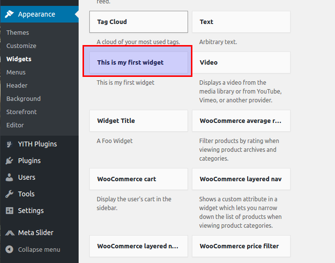
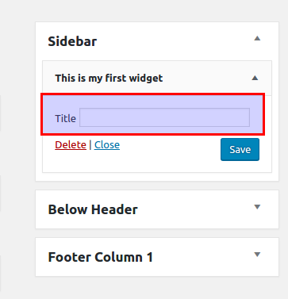

# My Social Plugin

This is a WordPress plugin sample to creating a WidGet.

### Don't use it!!

WordPress already has a simple API to let you create your Widget.

To create a Widget is necessary create a class and extend `WP_Widget`, like what's did in `widget/my_widget.php`.

After extended `WP_Widget` is necessary implement constructor, passing an alias for your plugin and a description.
 
 ```php
 <?php
class Your_Widget extends WP_Widget
{
    public function __construct()
    {
        parent::__construct('your_widget', "This is my first widget");
    }
}
 ```

 

 To implement the configuration form like this is necessary implement the `form` function:
 
 

  ```php
 <?php
 class Your_Widget extends WP_Widget
 {
     public function __construct()
     {
         parent::__construct('your_widget', "This is my first widget");
     }
     
     public function widget($args, $instance)
     {
     ?>
         <p>
             <label>Title</label>
             <input type="text" name="<?php echo $this->get_field_name('title'); ?>">
         </p>
     <?php   
     }
 }
  ```